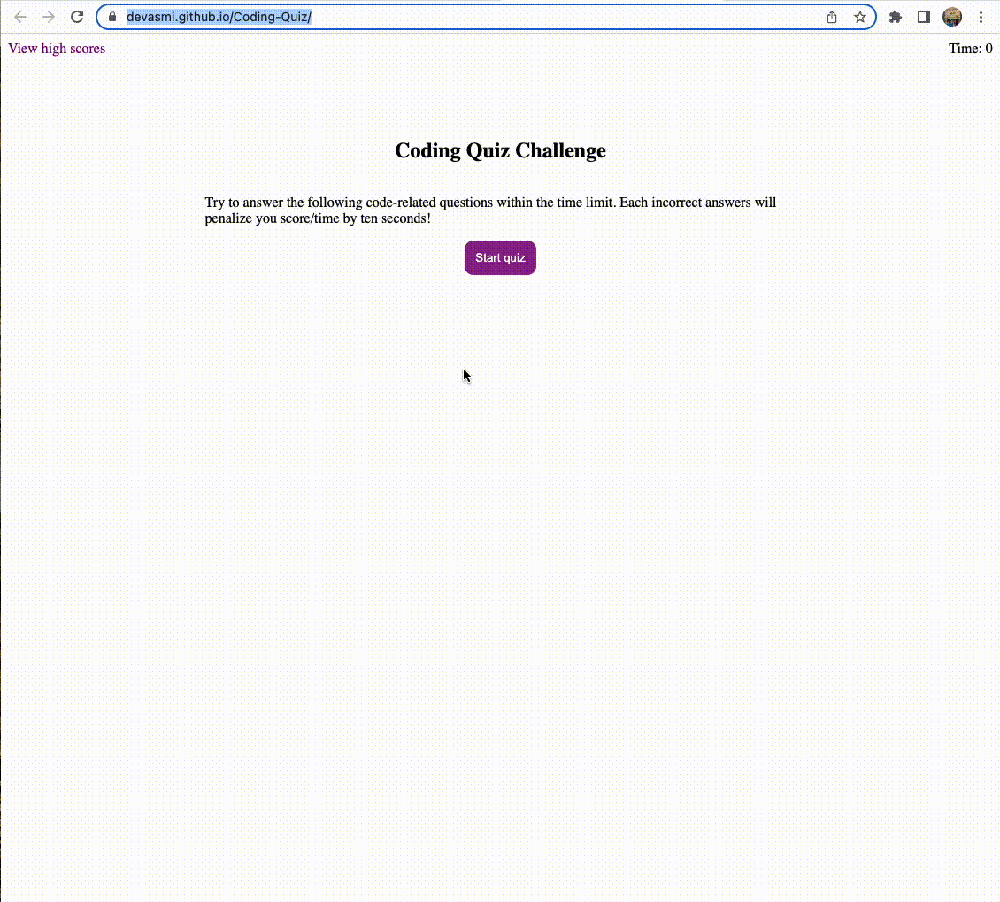

# Coding-Quiz

Link to github deployed page

[coding-quiz](https://devasmi.github.io/Coding-Quiz/)

## Description

It is a Coding-Quiz game where you will be able to answer the questions by clicking on one of the options.

There will be time decremented by 10 seconds on each wrong answer.

If you give the correct answer it will display the 'Correct' and for incorrect answer it will display 'InCorrect'.

Once the game is over, you will be able to save your initials and highscore value.

## Visuals

